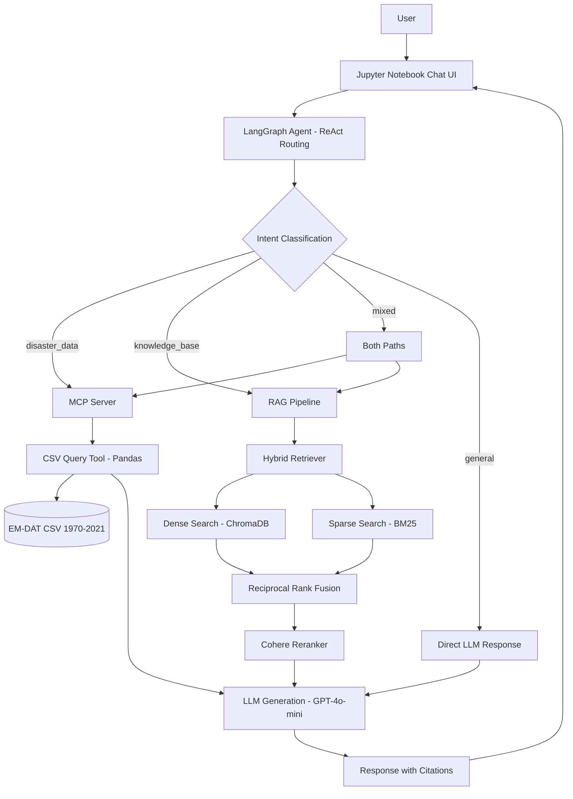

# Natural Disaster Chat Application

A chatbot that composes a **RAG module** (PDF knowledge retrieval) with an **MCP module** (CSV disaster data querying) via a **LangGraph agent**.

## Architecture



## Setup

### Prerequisites

- Python 3.11+
- OpenAI API key
- (Optional) Cohere API key for reranking

### Installation

```bash
# Clone
git clone <repo-url>
cd dl-ai-sas-chat-rag-mcp

# Create virtual environment
python -m venv .venv
source .venv/bin/activate  # macOS/Linux

# Install dependencies
pip install -r requirements.txt

# Configure API keys
cp .env.example .env
# Edit .env with your keys
```

### Run the Notebook

Open `natural-disaster-chat-app.ipynb` in Jupyter or VS Code and run cells top-to-bottom.

## Dataset

- **EM-DAT International Disaster Database** (1970-2021): 14,644 records across 228 countries
- Source: [EM-DAT (CRED)](https://www.emdat.be/) / [Kaggle mirror](https://www.kaggle.com/datasets/brsdincer/all-natural-disasters-1900-2021)
- File: `data/1970-2021_DISASTERS.xlsx - emdat data.csv`
- (Optional) PDF knowledge base in `data/pdfs/`

## Project Structure

```
├── natural-disaster-chat-app.ipynb   # Main notebook (thin orchestrator)
├── src/
│   ├── config.py                     # Centralized configuration
│   ├── ingestion/
│   │   ├── loaders.py                # PDF + CSV document loaders
│   │   └── chunking.py               # Hierarchical parent/child chunking
│   ├── retrieval/
│   │   ├── vectorstore.py            # Embeddings + ChromaDB
│   │   ├── hybrid.py                 # Dense + BM25 + RRF hybrid retriever
│   │   └── reranker.py               # Cohere reranker with fallback
│   ├── agent/
│   │   ├── prompts.py                # System + routing prompt templates
│   │   ├── routing.py                # LLM-based intent classification
│   │   └── graph.py                  # LangGraph StateGraph agent
│   ├── mcp_server/
│   │   ├── models.py                 # Pydantic response envelope
│   │   ├── validation.py             # CSV schema validation
│   │   ├── csv_tool.py               # Pandas query engine
│   │   └── server.py                 # FastMCP server (stdio)
│   ├── evaluation/
│   │   ├── evaluator.py              # RAGAS + custom metrics
│   │   ├── dashboard.py              # Plotly metric visualization
│   │   └── strategy_comparison.py    # 4-strategy comparison
│   └── visualization/
│       ├── charts.py                 # 5 Plotly charts
│       ├── diagrams.py               # NetworkX graph + Mermaid
│       └── report.py                 # HTML report generator
├── tests/
│   ├── unit/                         # Unit tests
│   ├── contract/                     # Contract/envelope tests
│   └── integration/                  # E2E integration tests
├── data/
│   ├── 1970-2021_DISASTERS.xlsx - emdat data.csv
│   └── golden_dataset.json           # 50 Q&A evaluation pairs
├── output/
│   └── report.html                   # Generated HTML report
├── requirements.txt
└── .env.example
```

## Tech Stack

| Component | Technology |
|-----------|-----------|
| Framework | LangChain, LangGraph |
| LLM | GPT-4o-mini (OpenAI) |
| Embeddings | BAAI/bge-m3 (HuggingFace) / OpenAI fallback |
| Vector Store | ChromaDB |
| Sparse Search | BM25 (rank-bm25) |
| Reranker | Cohere (with graceful fallback) |
| MCP Server | FastMCP (stdio transport) |
| Data Processing | Pandas |
| Visualization | Plotly, NetworkX |
| Evaluation | RAGAS, custom metrics |
| Testing | pytest |

## Usage Examples

### Chat UI (Streamlit)

```bash
streamlit run streamlit_app.py
# Opens at http://localhost:8501
```

The Streamlit app provides an interactive chat interface with:
- Full LangGraph agent (RAG + MCP + routing)
- Conversation history across messages
- Intent display for each response
- One-time model & vectorstore loading (cached)

You can also launch it from the notebook (Section 9).

### Notebook

```python
# Data query (routes to MCP)
chat("How many earthquakes occurred in Japan between 2000 and 2020?")

# Knowledge query (routes to RAG)
chat("What causes earthquakes and how do early warning systems work?")

# Mixed query (routes to both)
chat("Why was the 2010 Haiti earthquake so deadly?")
```

## Testing

```bash
# Run all tests
pytest tests/ -v

# With coverage
pytest tests/ --cov=src --cov-report=term-missing

# Run specific test category
pytest tests/unit/ -v
pytest tests/contract/ -v
pytest tests/integration/ -v
```

## Features

- **Hybrid Retrieval**: Dense (ChromaDB) + Sparse (BM25) + Reciprocal Rank Fusion + Cohere Reranking
- **Hierarchical Chunking**: Parent (2048 chars) / child (512 chars) chunks for context-aware retrieval
- **Intent-Based Routing**: LLM classifies queries → disaster_data, knowledge_base, mixed, general
- **MCP Server**: FastMCP server with CSV query tool via Pandas
- **Evaluation**: Golden dataset (50 Q&A), CSV correctness, hit rate@5, 4-strategy comparison
- **Visualizations**: 5 Plotly charts + NetworkX force-directed graph + Mermaid architecture diagrams
- **HTML Report**: Styled report with all visualizations at `output/report.html`