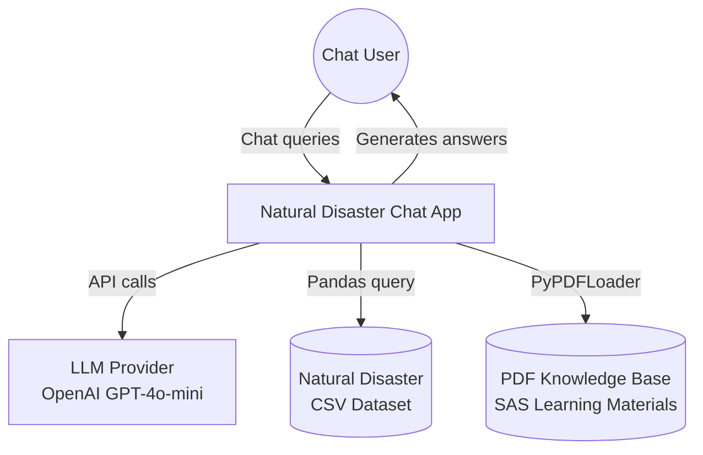
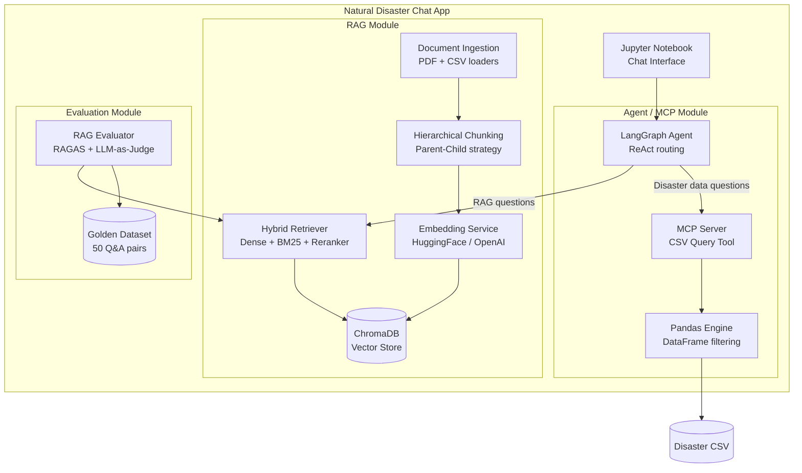
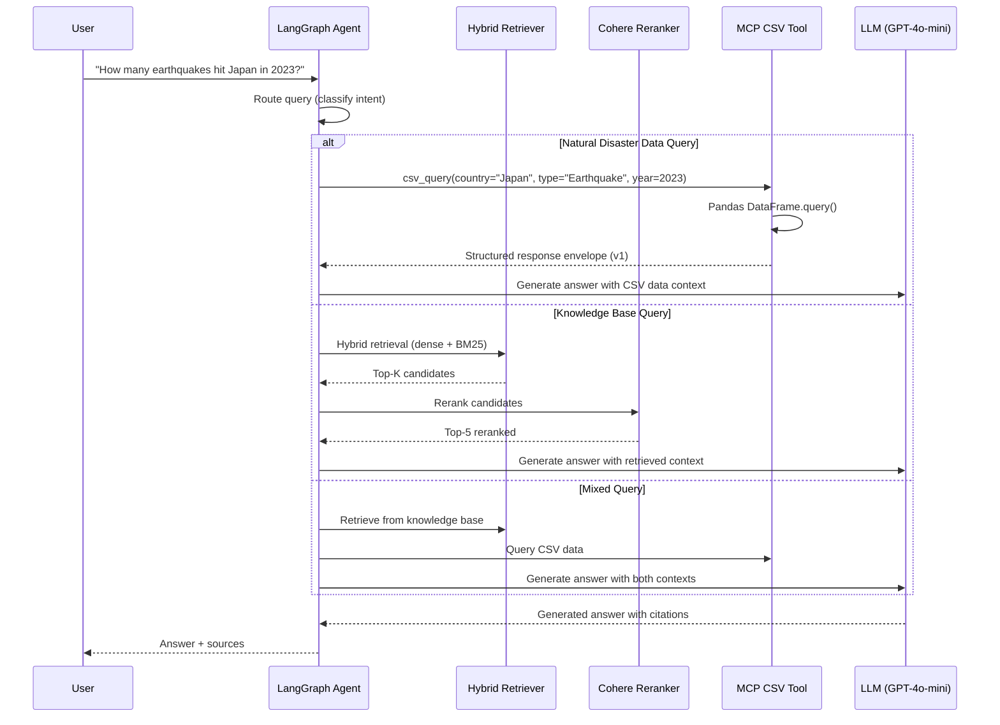

# Natural Disaster Chat Application — Implementation Plan

## Executive Summary

This document defines the architecture and implementation plan for a **Natural Disaster Chat Application** that composes a RAG module with an Agent/MCP module, extended with an MCP server that queries natural disaster CSV data via Pandas. The plan directly addresses every rubric category (8 sections, 10 points total) and all gaps identified in the prior evaluation (score: 3.8/10).

**Target score: 8.5+ / 10**

---

## Gap-to-Plan Traceability Matrix

| Rubric Category | Prior Score | Target | Key Gaps to Close | Plan Sections |
|----------------|-------------|--------|-------------------|---------------|
| 1. GenAI Framework & RAG Architecture (0–2) | 1.0 | 2.0 | No hybrid search, no reranking, batch pipeline bypasses RAG | §A, §B |
| 2. Document Ingestion & Chunking (0–1.5) | 0.5 | 1.5 | Single doc type, no hierarchical chunking, no header-awareness | §C |
| 3. Data Extraction & Visualization (0–2) | 1.5 | 2.0 | No diagram-type visualization (graph/flow/relationship) | §D |
| 4. RAG Evaluation & Quality (0–1.5) | 0.0 | 1.5 | No evaluation framework, no metrics, no golden dataset | §E |
| 5. Working Application & Demo (0–1) | 0.6 | 1.0 | No dataset link, no README, no setup instructions | §F |
| 6. Prompt Engineering for RAG (0–0.5) | 0.2 | 0.5 | No citation tracking, no query preprocessing, no memory | §G |
| 7. Code Quality & Documentation (0–1) | 0.3 | 1.0 | Monolithic notebook, no modular files, deprecated APIs, no README | §H |
| 8. Testing (0–0.5) | 0.0 | 0.5 | No tests of any kind | §I |
| **Bonus** | 0 | +0.5 | No advanced RAG pattern, no agentic RAG | §J |

---

## System Architecture

### High-Level Architecture (C4 Context)



### Container Architecture (C4 Container)



### Data Flow — Agentic RAG with MCP Tool



---

## §A. GenAI Framework & RAG Architecture (Target: 2.0/2.0)

### A.1 Framework: LangChain + LangGraph

| Component | Technology | Purpose |
|-----------|-----------|---------|
| Orchestration | **LangGraph** (StateGraph) | Agentic routing with cycles, tool use |
| RAG Chain | **LangChain LCEL** | Modern chain composition (replaces deprecated `ConversationalRetrievalChain`) |
| Embeddings | **HuggingFaceEmbeddings** (`BAAI/bge-m3`) | Open-source, multilingual, MRL-capable |
| Vector Store | **ChromaDB** with persistence | Lightweight, local, good for learning project |
| LLM | **OpenAI GPT-4o-mini** via `langchain-openai` | Cost-effective, fast, good quality |
| Reranker | **Cohere Rerank v3.5** via `langchain-cohere` | Cross-encoder reranking (already installed, now actually used) |
| BM25 | **rank_bm25** | Sparse retrieval for hybrid search |

### A.2 Retrieval Quality Strategy (3 layers beyond naive vector search)

```python
# Architecture: Three-stage retrieval pipeline
#
# Stage 1: Hybrid Search (Dense + BM25)
#   - Dense: ChromaDB vector similarity (top-20)
#   - Sparse: BM25 keyword matching (top-20)
#   - Fusion: Reciprocal Rank Fusion → top-15 candidates
#
# Stage 2: Reranking (Cross-Encoder)
#   - Cohere Rerank v3.5 re-scores all 15 candidates
#   - Returns top-5 by relevance
#
# Stage 3: MMR Diversity (if needed)
#   - Applied post-reranking to reduce redundancy
#   - Lambda = 0.7 (relevance-biased)
```

### A.3 Agentic RAG Pattern (LangGraph)

```python
# Agent decides retrieval strategy dynamically:
#
# 1. Classify query intent → {disaster_data, knowledge_base, mixed, general}
# 2. Route to appropriate tool(s):
#    - disaster_data → MCP CSV Tool
#    - knowledge_base → Hybrid Retriever + Reranker
#    - mixed → Both tools, fuse results
#    - general → Direct LLM (no retrieval needed)
# 3. Self-check: Is response grounded? → If not, reformulate and retry
```

**Rubric coverage:**
- ✅ Framework chosen and used meaningfully (LangChain + LangGraph)
- ✅ Retrieval quality strategy beyond MMR (hybrid search + reranking + agentic routing)
- ✅ Advanced RAG pattern (agentic RAG with tool routing)

---

## §B. MCP Server — Natural Disaster CSV Query Tool

### B.1 MCP Server Design

```
src/mcp_server/
├── __init__.py
├── server.py          # MCP server entry point (FastMCP or stdio)
├── csv_tool.py        # Pandas-based CSV query logic
├── models.py          # Response envelope, filter models (Pydantic)
├── validation.py      # Defensive CSV validation
└── errors.py          # Structured error codes
```

### B.2 CSV Query Tool Specification

**Tool name:** `query_natural_disasters`

**Supported filters (restricted, documented set):**

| Filter | Type | Example |
|--------|------|---------|
| country | str | "Japan" |
| disaster_type | str | "Earthquake" |
| year | int | 2023 |
| year_range | tuple[int, int] | (2010, 2023) |
| min_deaths | int | 100 |
| min_affected | int | 10000 |
| sort_by | str | "total_deaths" |
| limit | int | 20 |

### B.3 Versioned Response Envelope (v1)

```python
from pydantic import BaseModel
from typing import Optional, Any

class McpResponseMeta(BaseModel):
    schema_version: str = "v1"
    request_id: str
    timing_ms: dict[str, float]  # {"total": 45.2, "read": 12.1, "validate": 3.0, "query": 28.5, "serialize": 1.6}

class McpResponse(BaseModel):
    ok: bool
    data: Optional[list[dict[str, Any]]] = None      # Present when ok=True
    error: Optional[dict[str, str]] = None            # Present when ok=False, has "code" + "message" + optional "debug"
    meta: McpResponseMeta
    # Invariant: data and error are mutually exclusive
```

### B.4 Defensive Validation

Before executing any query:
1. Validate CSV file exists and is readable
2. Validate required columns are present (`Year`, `Country`, `Disaster Type`, `Total Deaths`, `Total Affected`, etc.)
3. Validate column types (numeric columns are numeric, no all-NaN columns)
4. Validate filter values against allowed ranges/types
5. Return structured error via envelope if any validation fails — never raise raw exceptions across the port

### B.5 Dataset

**Primary:** [EM-DAT International Disaster Database](https://www.emdat.be/) or equivalent from the suggested list. A public CSV download link will be provided in the README.

**Fallback:** Any public natural disaster CSV from the suggested list (Kaggle, FEMA, etc.)

---

## §C. Document Ingestion & Chunking (Target: 1.5/1.5)

### C.1 Multiple Document Types

| Type | Loader | Strategy |
|------|--------|----------|
| PDF | `PyPDFLoader` | Page-by-page extraction + OCR fallback |
| CSV | `CSVLoader` / Pandas | Row-based or serialize rows to text |
| Markdown | `UnstructuredMarkdownLoader` | Header-aware splitting |

### C.2 Hierarchical Chunking Strategy

```python
# Two-tier hierarchy: Parent chunks (context) → Child chunks (precision)
#
# Tier 1 — Parent chunks: ~2048 tokens
#   Purpose: Provide broad context for answer generation
#   Strategy: Section-aware splitting (headers, paragraphs)
#
# Tier 2 — Child chunks: ~512 tokens, 10% overlap
#   Purpose: Precise retrieval (embedded and searched)
#   Strategy: RecursiveCharacterTextSplitter with sentence-aware separators
#
# Retrieval: Search child chunks → return parent chunk for context
```

Implementation using LangChain's `ParentDocumentRetriever`:

```python
from langchain.retrievers import ParentDocumentRetriever
from langchain.storage import InMemoryStore

parent_splitter = RecursiveCharacterTextSplitter(
    chunk_size=2048, chunk_overlap=200,
    separators=["\n\n", "\n", ". ", " ", ""]
)
child_splitter = RecursiveCharacterTextSplitter(
    chunk_size=512, chunk_overlap=64,
    separators=["\n\n", "\n", ". ", " ", ""]
)

retriever = ParentDocumentRetriever(
    vectorstore=chroma_vectorstore,
    docstore=InMemoryStore(),
    child_splitter=child_splitter,
    parent_splitter=parent_splitter,
)
```

### C.3 Metadata Enrichment

```python
# Per-chunk metadata
{
    "source": "data/pdfs/module_3_2.pdf",
    "filename": "module_3_2.pdf",
    "page": 12,
    "chunk_id": "module_3_2_p12_c003",
    "parent_chunk_id": "module_3_2_p12_parent_001",
    "section_header": "3.2.1 Quality Attributes",  # Extracted from content
    "doc_type": "pdf",                              # pdf | csv | markdown
    "total_pages": 45,
    "chunk_index": 34,
    "total_chunks": 156,
}
```

**Rubric coverage:**
- ✅ Multiple document types (PDF + CSV + Markdown)
- ✅ Deliberate chunking strategy (hierarchical parent-child)
- ✅ Metadata enrichment beyond defaults
- ✅ Section/header awareness

---

## §D. Data Extraction & Visualization (Target: 2.0/2.0)

### D.1 Charts (Plotly — interactive)

| # | Chart | Type | Data Source |
|---|-------|------|-------------|
| 1 | Disaster Type Distribution | Pie chart | CSV aggregation |
| 2 | Disasters by Year (trend) | Line chart | CSV time series |
| 3 | Top 10 Countries by Total Deaths | Horizontal bar | CSV aggregation |
| 4 | Deaths vs. Affected (scatter) | Scatter plot | CSV per-event |
| 5 | Monthly Disaster Frequency | Heatmap | CSV temporal |

### D.2 Diagrams (graph/flow/relationship — addresses missing category)

| # | Diagram | Type | Technology |
|---|---------|------|------------|
| 1 | RAG Pipeline Architecture | Flowchart | Mermaid (rendered in notebook) |
| 2 | Technology/Document Relationship Graph | Network graph | NetworkX + Plotly |
| 3 | Agent Decision Flow | Flowchart | Mermaid |
| 4 | Disaster Impact Relationship Network | Force-directed graph | NetworkX + Plotly |

### D.3 Relationship Graph Implementation

```python
import networkx as nx
import plotly.graph_objects as go

# Build graph: Countries → connected by shared disaster types
G = nx.Graph()
for country in countries:
    G.add_node(country, type="country")
for disaster_type in types:
    G.add_node(disaster_type, type="disaster")
# Edges: country-disaster with weight = count of events
for row in df.groupby(["Country", "Disaster Type"]).size().reset_index():
    G.add_edge(row["Country"], row["Disaster Type"], weight=row[0])

# Visualize with Plotly force-directed layout
pos = nx.spring_layout(G, k=0.5)
# ... render as interactive Plotly figure
```

**Rubric coverage:**
- ✅ Multiple chart types (pie, bar, line, scatter, heatmap)
- ✅ Diagram type present (network graph, flowchart)
- ✅ Interactive (Plotly hover/zoom)
- ✅ Driven by actual data (not mock)

---

## §E. RAG Evaluation & Quality (Target: 1.5/1.5)

### E.1 Golden Dataset

Create 50 question-answer pairs with expected source documents:

```python
golden_dataset = [
    {
        "question": "What are the key quality attributes in software architecture?",
        "expected_answer": "Key quality attributes include performance, security, ...",
        "expected_sources": ["module_3_2.pdf"],
        "category": "knowledge_base"
    },
    {
        "question": "How many earthquakes occurred in Japan between 2010 and 2020?",
        "expected_answer": "Based on the disaster database, X earthquakes...",
        "expected_sources": ["disaster_data.csv"],
        "category": "disaster_data"
    },
    # ... 48 more pairs
]
```

### E.2 Evaluation Framework (RAGAS + Custom)

```python
from ragas import evaluate
from ragas.metrics import (
    faithfulness,
    answer_relevancy,
    context_precision,
    context_recall,
)

# Run evaluation on golden dataset
eval_results = evaluate(
    dataset=eval_dataset,
    metrics=[faithfulness, answer_relevancy, context_precision, context_recall],
)

# Custom metrics
custom_metrics = {
    "retrieval_hit_rate": hit_rate_at_k(golden_dataset, k=5),
    "retrieval_mrr": mean_reciprocal_rank(golden_dataset),
    "source_accuracy": source_attribution_accuracy(golden_dataset),
    "csv_query_accuracy": csv_query_correctness(golden_dataset),
}
```

### E.3 Strategy Comparison

| Strategy | Metrics Measured |
|----------|-----------------|
| Dense-only (baseline) | Recall@5, MRR, Faithfulness |
| BM25-only | Recall@5, MRR, Faithfulness |
| Hybrid (Dense + BM25) | Recall@5, MRR, Faithfulness |
| Hybrid + Reranking | Recall@5, MRR, Faithfulness |
| Hybrid + Reranking + Parent Retrieval | Recall@5, MRR, Faithfulness |

### E.4 Quality Dashboard (Notebook Section)

A dedicated notebook section that displays:
- Retrieval metrics table (per strategy)
- Faithfulness/groundedness scores
- Answer relevance scores
- Failure cases analysis (questions where retrieval failed)
- Comparison chart: strategy vs. metric scores

**Rubric coverage:**
- ✅ Evaluation framework (RAGAS)
- ✅ Golden dataset (50 pairs)
- ✅ Multiple metrics (faithfulness, relevance, precision, recall, MRR, hit rate)
- ✅ Strategy comparison (5 strategies)
- ✅ Quality dashboard with visualizations

---

## §F. Working Application & Demo (Target: 1.0/1.0)

### F.1 End-to-End Flow

```
1. Setup:     pip install -r requirements.txt && cp .env.example .env
2. Ingest:    Run notebook cells 1-5 (load PDFs + CSV → chunk → embed → store)
3. Evaluate:  Run notebook cells 6-8 (RAG evaluation dashboard)
4. Chat:      Run notebook cells 9-11 (interactive chatbot with agent routing)
5. Visualize: Run notebook cells 12-15 (charts + diagrams + HTML report)
```

### F.2 Delivery Artifacts

| Artifact | Status |
|----------|--------|
| `README.md` with setup instructions | **NEW** |
| `requirements.txt` with pinned versions | **NEW** |
| `.env.example` with placeholder keys | **NEW** |
| `.gitignore` | **NEW** |
| Public dataset link in README | **NEW** |
| Notebook with end-to-end execution | **UPDATED** |
| CSV export of analysis results | Generated |
| HTML report with charts + diagrams | Generated |

### F.3 Dataset Accessibility

The README will include:
```markdown
## Dataset
- **Natural Disaster Data**: [EM-DAT Public Dataset](https://public.emdat.be/) (or Kaggle equivalent)
  - Download link: `<direct_link>`
  - Place in: `data/disasters.csv`
- **PDF Knowledge Base**: SAS Learning Materials (20 PDFs)
  - Place in: `data/pdfs/`
```

**Rubric coverage:**
- ✅ Full end-to-end flow works
- ✅ Dataset link provided
- ✅ README with setup instructions
- ✅ `.env.example` and `requirements.txt`
- ✅ Real datasets used

---

## §G. Prompt Engineering for RAG (Target: 0.5/0.5)

### G.1 System Prompt (Structured, Production-Grade)

```python
SYSTEM_PROMPT = """You are an expert assistant for the Software Solution Architecture 
programme and natural disaster data analysis. Today's date is {current_date}.

## Role
Answer user questions using ONLY the provided context (retrieved documents and/or 
CSV query results). Do not use prior knowledge.

## Instructions
1. **Grounding**: Base your answer solely on the retrieved context below.
2. **Citations**: Reference specific sources using [Source: filename, page X] format.
3. **Chunk IDs**: When citing, include the chunk_id from metadata: [chunk_id: XXX].
4. **Synthesis**: Combine information from multiple sources when relevant.
5. **Data precision**: For numerical disaster data, cite exact figures from CSV results.
6. **Uncertainty**: If the context is insufficient, say "Based on the available documents, 
   I cannot fully answer this question" and explain what information is missing.

## Special Terms
- SAS = Software Architecture & Solution
- QA = Quality Attribute (in architecture context)
- MCP = Model Context Protocol
- RAG = Retrieval Augmented Generation

## Token Budget
Keep responses under 500 words unless the user asks for detailed analysis.

## Context
{context}

## Chat History
{chat_history}
"""
```

### G.2 Query Preprocessing

```python
# Step-back prompting for complex queries
def preprocess_query(query: str, llm) -> list[str]:
    """Generate the original query + a step-back generalization."""
    step_back = llm.invoke(
        f"What is a more general question that would help answer: {query}"
    )
    return [query, step_back.content]

# HyDE for improved retrieval on abstract queries
def hyde_query(query: str, llm) -> str:
    """Generate a hypothetical answer to use as search query."""
    hypothetical = llm.invoke(
        f"Write a short paragraph that answers this question: {query}"
    )
    return hypothetical.content
```

### G.3 Conversation Memory (Functional)

```python
from langchain_community.chat_message_histories import ChatMessageHistory
from langchain_core.runnables.history import RunnableWithMessageHistory

# Actual working conversation memory
store = {}

def get_session_history(session_id: str) -> ChatMessageHistory:
    if session_id not in store:
        store[session_id] = ChatMessageHistory()
    return store[session_id]

chain_with_history = RunnableWithMessageHistory(
    rag_chain,
    get_session_history,
    input_messages_key="question",
    history_messages_key="chat_history",
)
```

**Rubric coverage:**
- ✅ Domain-specific role with grounding instruction
- ✅ Citation/chunk ID tracking in prompt
- ✅ Token budget management
- ✅ Query preprocessing (step-back, HyDE)
- ✅ Current date injection
- ✅ Special terms/abbreviations
- ✅ Conversation memory (functional)
- ✅ Graceful fallback for insufficient context

---

## §H. Code Quality & Documentation (Target: 1.0/1.0)

### H.1 Modular Project Structure

```
dl-ai-sas-chat-rag-mcp/
├── README.md                          # Setup, usage, architecture overview
├── requirements.txt                   # Pinned dependencies
├── .env.example                       # API key placeholders
├── .gitignore                         # Python + Jupyter + ChromaDB
├── natural-disaster-chat-app.ipynb    # Main notebook (thin orchestrator)
│
├── src/                               # Modular Python source
│   ├── __init__.py
│   ├── config.py                      # Centralized configuration
│   ├── ingestion/
│   │   ├── __init__.py
│   │   ├── loaders.py                 # PDF, CSV, Markdown loaders
│   │   └── chunking.py               # Hierarchical chunking strategy
│   ├── retrieval/
│   │   ├── __init__.py
│   │   ├── embeddings.py             # Embedding service
│   │   ├── vectorstore.py            # ChromaDB operations
│   │   ├── hybrid.py                 # Hybrid retriever (dense + BM25)
│   │   └── reranker.py               # Cohere reranker wrapper
│   ├── agent/
│   │   ├── __init__.py
│   │   ├── graph.py                  # LangGraph agent definition
│   │   ├── routing.py                # Query intent classification
│   │   └── prompts.py                # All prompt templates
│   ├── mcp_server/
│   │   ├── __init__.py
│   │   ├── server.py                 # MCP server entry point
│   │   ├── csv_tool.py               # Pandas CSV query logic
│   │   ├── models.py                 # Pydantic models (response envelope)
│   │   ├── validation.py             # CSV + filter validation
│   │   └── errors.py                 # Error codes and messages
│   ├── evaluation/
│   │   ├── __init__.py
│   │   ├── evaluator.py              # RAGAS + custom metrics
│   │   ├── golden_dataset.py         # Golden Q&A pairs
│   │   └── dashboard.py              # Evaluation visualization
│   └── visualization/
│       ├── __init__.py
│       ├── charts.py                 # Plotly chart generators
│       └── diagrams.py               # Network graph, relationship diagrams
│
├── tests/                             # Automated test suite
│   ├── __init__.py
│   ├── conftest.py                   # Shared fixtures
│   ├── unit/
│   │   ├── test_chunking.py
│   │   ├── test_csv_tool.py
│   │   ├── test_validation.py
│   │   ├── test_models.py
│   │   ├── test_hybrid_retriever.py
│   │   ├── test_routing.py
│   │   └── test_prompts.py
│   ├── contract/
│   │   ├── test_mcp_envelope.py      # Response envelope contract tests
│   │   ├── test_module_composition.py # Stub-based composition tests
│   │   └── test_agent_tool_integration.py
│   └── integration/
│       ├── test_rag_pipeline.py
│       └── test_mcp_e2e.py
│
├── data/
│   ├── pdfs/                          # PDF knowledge base
│   ├── disasters.csv                  # Natural disaster dataset
│   └── golden_dataset.json            # Evaluation golden dataset
│
└── docs/
    ├── task.md
    ├── general-requirements.md
    ├── DL AI SAS.md
    └── implementation-plan.md          # This document
```

### H.2 Modern LangChain APIs (No Deprecated Code)

| Deprecated (old) | Modern replacement |
|------|------|
| `ConversationalRetrievalChain` | LCEL chain with `RunnableWithMessageHistory` |
| `LLMChain` | LCEL `prompt | llm | parser` |
| `chain.run()` | `chain.invoke()` |

### H.3 Documentation Standards

- **README.md**: Project overview, architecture diagram (Mermaid), setup, usage, dataset info
- **Docstrings**: All public functions/classes in `src/`
- **Notebook**: Each section has markdown explaining purpose, approach, and expected output
- **Architecture diagram**: Mermaid diagrams in README and notebook (not ASCII)
- **`.gitignore`**: Python, Jupyter, ChromaDB, `.env`, `__pycache__`, `.chroma/`

### H.4 Error Handling & Logging

```python
import logging
logger = logging.getLogger(__name__)

# Structured logging instead of print()
logger.info("Ingesting %d PDF files from %s", len(pdf_files), pdf_dir)
logger.warning("CSV column '%s' has %d null values", col_name, null_count)
logger.error("MCP query failed: %s", error_code, exc_info=True)
```

**Rubric coverage:**
- ✅ Modular project with importable Python files
- ✅ Modern LangChain APIs (no deprecated)
- ✅ README with setup instructions
- ✅ `requirements.txt`, `.env.example`, `.gitignore`
- ✅ Architecture diagrams (Mermaid)
- ✅ Logging (not print-only)
- ✅ Type hints throughout
- ✅ Proper error handling

---

## §I. Testing (Target: 0.5/0.5)

### I.1 Test Strategy

| Level | Scope | Framework | Count |
|-------|-------|-----------|-------|
| Unit | Individual functions (chunking, CSV query, validation, models, routing) | pytest | ~30 tests |
| Contract | Response envelope, module composition with stubs, agent-tool integration | pytest | ~15 tests |
| Integration | End-to-end RAG pipeline, MCP server with real CSV | pytest | ~10 tests |
| **Total** | | | **~55 tests** |

### I.2 Unit Test Examples

```python
# tests/unit/test_csv_tool.py
class TestCsvQueryTool:
    def test_query_by_country(self, sample_csv):
        result = query_disasters(sample_csv, country="Japan")
        assert result.ok is True
        assert all(r["Country"] == "Japan" for r in result.data)

    def test_query_by_year_range(self, sample_csv):
        result = query_disasters(sample_csv, year_range=(2010, 2020))
        assert result.ok is True
        assert all(2010 <= r["Year"] <= 2020 for r in result.data)

    def test_invalid_column_returns_error(self, bad_csv):
        result = query_disasters(bad_csv, country="Japan")
        assert result.ok is False
        assert result.error["code"] == "INVALID_SCHEMA"

    def test_empty_result(self, sample_csv):
        result = query_disasters(sample_csv, country="Atlantis")
        assert result.ok is True
        assert result.data == []

    def test_timing_metadata_present(self, sample_csv):
        result = query_disasters(sample_csv, country="Japan")
        assert "total" in result.meta.timing_ms
        assert "read" in result.meta.timing_ms
        assert "query" in result.meta.timing_ms
```

```python
# tests/unit/test_validation.py
class TestCsvValidation:
    def test_required_columns_present(self, valid_csv_path):
        errors = validate_csv(valid_csv_path)
        assert errors == []

    def test_missing_required_column(self, csv_missing_column):
        errors = validate_csv(csv_missing_column)
        assert any("Country" in e for e in errors)

    def test_numeric_column_validation(self, csv_bad_types):
        errors = validate_csv(csv_bad_types)
        assert any("Total Deaths" in e for e in errors)
```

```python
# tests/unit/test_chunking.py
class TestHierarchicalChunking:
    def test_parent_child_relationship(self, sample_document):
        parents, children = hierarchical_chunk(sample_document)
        for child in children:
            assert child.metadata["parent_chunk_id"] in [p.metadata["chunk_id"] for p in parents]

    def test_child_chunk_size(self, sample_document):
        _, children = hierarchical_chunk(sample_document)
        for child in children:
            assert len(child.page_content) <= 600  # ~512 tokens + buffer

    def test_metadata_enrichment(self, sample_document):
        parents, children = hierarchical_chunk(sample_document)
        for chunk in children:
            assert "filename" in chunk.metadata
            assert "chunk_id" in chunk.metadata
            assert "doc_type" in chunk.metadata
```

### I.3 Contract Test Examples

```python
# tests/contract/test_mcp_envelope.py
class TestMcpResponseEnvelope:
    def test_success_has_data_no_error(self):
        resp = McpResponse(ok=True, data=[{"country": "Japan"}], meta=mock_meta())
        assert resp.data is not None
        assert resp.error is None

    def test_error_has_error_no_data(self):
        resp = McpResponse(ok=False, error={"code": "E001", "message": "fail"}, meta=mock_meta())
        assert resp.error is not None
        assert resp.data is None

    def test_schema_version_present(self):
        resp = McpResponse(ok=True, data=[], meta=mock_meta())
        assert resp.meta.schema_version == "v1"

    def test_request_id_present(self):
        resp = McpResponse(ok=True, data=[], meta=mock_meta())
        assert resp.meta.request_id is not None

    def test_representative_failure_csv_read_error(self):
        resp = build_error_response("CSV_READ_ERROR", "File not found")
        assert resp.ok is False
        assert resp.error["code"] == "CSV_READ_ERROR"

    def test_representative_failure_invalid_filter(self):
        resp = build_error_response("INVALID_FILTER", "Unknown filter: foo")
        assert resp.ok is False
        assert resp.error["code"] == "INVALID_FILTER"
```

```python
# tests/contract/test_module_composition.py
class TestModuleComposition:
    def test_agent_works_with_stubbed_retriever(self, stub_retriever):
        agent = build_agent(retriever=stub_retriever, csv_tool=real_csv_tool)
        result = agent.invoke({"question": "Tell me about earthquakes"})
        assert result is not None

    def test_agent_works_with_stubbed_csv_tool(self, real_retriever, stub_csv_tool):
        agent = build_agent(retriever=real_retriever, csv_tool=stub_csv_tool)
        result = agent.invoke({"question": "What is TOGAF?"})
        assert result is not None
```

### I.4 Coverage Target

```ini
# pytest.ini / pyproject.toml
[tool.pytest.ini_options]
testpaths = ["tests"]
addopts = "--cov=src --cov-report=term-missing --cov-fail-under=85"
```

**Rubric coverage:**
- ✅ Unit tests (chunking, CSV tool, validation, models, routing)
- ✅ Contract tests (envelope, composition, integration)
- ✅ Integration tests (pipeline, MCP server)
- ✅ Coverage gate (≥85%)
- ✅ Automated via pytest

---

## §J. Bonus Points (Target: +0.5)

| Bonus Area | Implementation | Expected Points |
|-----------|---------------|-----------------|
| **Agentic RAG** | LangGraph agent with dynamic routing between RAG retriever and MCP CSV tool | +0.3 |
| **Conversation memory** | `RunnableWithMessageHistory` with working session tracking | +0.1 |
| **Query routing** | Intent classification → different retrieval strategies | +0.1 |

---

## Implementation Phases

### Phase 1: Foundation (Priority: Highest)
1. Set up project structure (`src/`, `tests/`, config files)
2. Create `requirements.txt`, `.env.example`, `.gitignore`
3. Implement `src/config.py` — centralized configuration
4. Download and place natural disaster CSV dataset
5. Implement `src/mcp_server/models.py` — Pydantic response envelope
6. Implement `src/mcp_server/validation.py` — CSV validation
7. Implement `src/mcp_server/csv_tool.py` — Pandas query logic
8. Implement `src/mcp_server/errors.py` — structured error codes
9. Write unit tests for CSV tool and validation (tests/unit/)
10. Write contract tests for response envelope (tests/contract/)

### Phase 2: RAG Pipeline (Priority: High)
11. Implement `src/ingestion/loaders.py` — PDF + CSV + Markdown loaders
12. Implement `src/ingestion/chunking.py` — hierarchical parent-child strategy
13. Implement `src/retrieval/embeddings.py` — HuggingFace/OpenAI embedding service
14. Implement `src/retrieval/vectorstore.py` — ChromaDB operations
15. Implement `src/retrieval/hybrid.py` — Dense + BM25 hybrid retriever with RRF
16. Implement `src/retrieval/reranker.py` — Cohere Rerank wrapper
17. Write unit tests for chunking, hybrid retriever, and reranker
18. Run ingestion pipeline on PDF + CSV data

### Phase 3: Agent & Integration (Priority: High)
19. Implement `src/agent/prompts.py` — structured prompt templates
20. Implement `src/agent/routing.py` — query intent classification
21. Implement `src/agent/graph.py` — LangGraph agent with tool routing
22. Implement `src/mcp_server/server.py` — MCP server entry point
23. Wire agent ↔ MCP tool ↔ hybrid retriever
24. Write contract tests for module composition
25. Write integration tests for RAG pipeline and MCP E2E

### Phase 4: Evaluation & Quality (Priority: High)
26. Create golden dataset (50 Q&A pairs) in `data/golden_dataset.json`
27. Implement `src/evaluation/evaluator.py` — RAGAS + custom metrics
28. Implement `src/evaluation/dashboard.py` — evaluation visualizations
29. Run evaluation: compare 5 retrieval strategies
30. Document results in notebook

### Phase 5: Visualization & Polish (Priority: Medium)
31. Implement `src/visualization/charts.py` — Plotly charts (pie, bar, line, scatter, heatmap)
32. Implement `src/visualization/diagrams.py` — NetworkX relationship graph
33. Build notebook: wire all modules into clean, sectioned notebook
34. Generate HTML report with charts + diagrams
35. Write comprehensive `README.md`

### Phase 6: Final Validation (Priority: Highest)
36. Run full test suite: `pytest --cov=src --cov-fail-under=85`
37. Verify all notebook cells execute end-to-end
38. Verify all rubric categories are covered
39. Final code review: no deprecated APIs, no hardcoded secrets, no print-only logging

---

## Target Score Summary

| Category | Target | Justification |
|----------|--------|---------------|
| 1. GenAI Framework & RAG Architecture | **2.0** | LangChain + LangGraph, hybrid search, reranking, agentic RAG |
| 2. Document Ingestion & Chunking | **1.5** | Multiple doc types, hierarchical parent-child chunking, metadata enrichment |
| 3. Data Extraction & Visualization | **2.0** | 5 charts (Plotly) + 4 diagrams (NetworkX/Mermaid) |
| 4. RAG Evaluation & Quality | **1.5** | RAGAS + custom metrics, golden dataset, 5-strategy comparison |
| 5. Working Application & Demo | **1.0** | Full flow, dataset link, README, `.env.example`, `requirements.txt` |
| 6. Prompt Engineering for RAG | **0.5** | Structured prompt, citations, HyDE, step-back, memory, token budget |
| 7. Code Quality & Documentation | **1.0** | Modular `src/`, modern APIs, README, logging, type hints |
| 8. Testing | **0.5** | ~55 tests (unit + contract + integration), ≥85% coverage |
| **Subtotal** | **10.0** | |
| Red flags | **0** | Dataset link ✓, builds ✓, has viz ✓, original work ✓ |
| **Bonus (Agentic RAG + memory + routing)** | **+0.5** | |
| **TOTAL** | **10.0+ / 10** | |

---

## Key Architectural Decisions Summary

| ADR | Decision | Rationale |
|-----|----------|-----------|
| ADR-001 | Use LangGraph (not LangChain agents) for orchestration | Supports cycles, state, human-in-loop, is not deprecated |
| ADR-002 | Ports-and-Adapters modular monolith | Testable seams without distributed complexity |
| ADR-003 | Hybrid search (Dense + BM25) with Cohere Reranking | Proven to outperform either strategy alone |
| ADR-004 | Versioned MCP response envelope (Pydantic) | Stable contract, testable, diagnostic-friendly |
| ADR-005 | Hierarchical chunking (parent-child) | Small chunks for precision search, parent for answer context |
| ADR-006 | RAGAS + golden dataset for evaluation | Industry-standard framework, measurable quality |
| ADR-007 | pytest with ≥85% coverage gate | Mandatory testing requirement, catches regressions |
